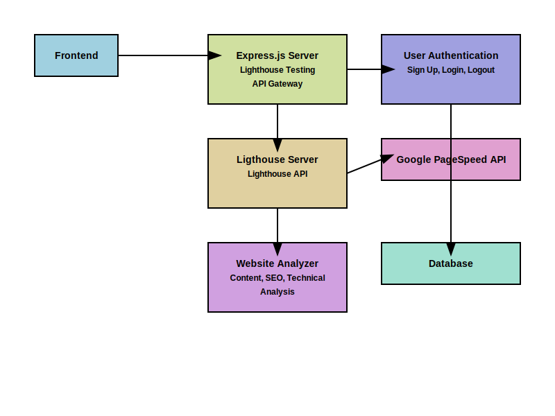

# Website Analysis and User Authentication System

## Overview
This project combines a website analysis tool with a user authentication system. It provides comprehensive website analysis including performance metrics, content analysis, SEO evaluation, and more. The system also includes user registration, login, and authentication features.

## Components

1. **Express Server (app.js)**
   - Handles Lighthouse performance testing
   - Exposes API for running Lighthouse tests

2. **Website Analyzer (analyzer.py)**
   - Scrapes and analyzes websites
   - Provides content, structure, SEO, technical, and compliance analysis
   - Fetches Core Web Vitals using Google PageSpeed Insights API

3. **Flask API (app.py)**
   - Exposes endpoint for website analysis
   - Integrates with the Python analyzer

4. **User Service (user-service.js)**
   - Manages user registration, login, and logout
   - Implements password hashing and JWT authentication
   - Verifies JWT tokens for protected routes
   

### Feel free read individual READMEs for more information

## Architecture

The system follows a layered architecture:




## Setup and Installation

1. Clone the repository
2. Install dependencies:
   ```
   npm install  # For Node.js dependencies
   pip install -r requirements.txt  # For Python dependencies
   ```
3. Set up environment variables (see individual README files)
4. Start the servers:
   ```
   npm start # Start Express server
   node app.js  # Start Lighthouse server
   python app.py  # Start Flask server
   ```

## Configuration

Create a `.env` file in the root directory with the following variables:

```
PORT=4000 - For Express app
PORT=5000 - For scraper service app
PORT=6000 - For Lighthouse app
CORS_ORIGIN=http://localhost:3000
TOKEN_KEY=your_secret_key_here
GOOGLE_API_KEY=your_google_api_key_here
```

## API Endpoints

### Lighthouse Analysis
- POST `/api/lighthouse`
  - Body: `{ "url": "https://example.com" }`
  - Returns comprehensive lighthouse analysis

### Website Analysis
- POST `/api/analyze`
  - Body: `{ "url": "https://example.com" }`
  - Returns comprehensive website analysis

### User Authentication
- POST `v1/api/users/signup`
  - Body: `{ "firstName", "lastName", "emailAddress", "phoneNumber", "age", "password" }`
- POST `v1/api/users/login`
  - Body: `{ "emailAddress", "password" }`
- POST `v1/api/users/logout`
  - Body: `{ "emailAddress" }`

## Security

- Passwords are hashed using bcrypt
- JWT is used for authentication
- CORS is configured for API security

## Future Improvements

- Implement rate limiting
- Add comprehensive error logging
- Set up CI/CD pipelines
- Implement caching for analysis results
- Consider moving to a microservices architecture for better scalability
- Improve NLP model 
