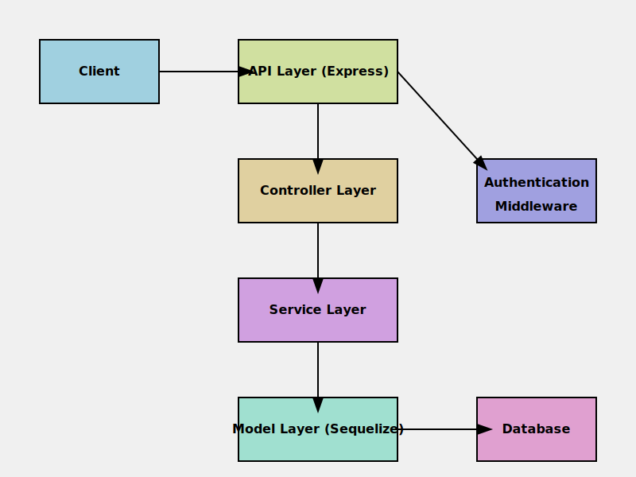

# User Authentication System Documentation

## Overview

This project implements a user authentication system using Node.js, Express, Sequelize ORM, and JSON Web Tokens (JWT). It provides functionality for user sign-up, login, and logout operations.

## Installation

1. Clone the repository:
   ```
   git clone https://github.com/kna-core/ByteBenders.git
   cd ByteBenders/server
   ```

2. Install required packages:
   ```
   npm install
   ```

## Usage

1. Start the Express server:
   ```
   node app.js
   ```

2. Send a POST request to analyze a website:
   ```
   curl -X POST -H "Content-Type: application/json" -d '{"url": "https://example.com"}' http://localhost:4000/v1/api/users/<route>
 


## Key Components

1. **User Controller** (`user-controller.js`): Handles HTTP requests for user operations.
2. **Authentication Middleware** (`auth.js`): Verifies JWT tokens for protected routes.
3. **Database Configuration** (`db.js`): Sets up Sequelize connection to the database.
4. **User Model** (`user-model.js`): Defines the User schema using Sequelize.
5. **User Service** (`user-service.js`): Implements business logic for user 
5. **User Route** (`user-route.js`): Implements routes logic for user operations.

## Architecture

The system follows a layered architecture:



### Key components:

- Controllers: Handle HTTP requests and responses
- Services: Implement business logic
- Models: Define data structures and database interactions
- Middleware: Provide cross-cutting concerns like authentication
- Database: Stores user information (using Sequelize ORM)

## Functionality

### 1. User Sign-up

- Validates required fields and email format.
- Checks for existing users with the same email.
- Hashes the password before storing.
- Creates a new user in the database.

### 2. User Login

- Validates required fields.
- Authenticates user credentials.
- Generates and stores a JWT token.
- Updates user's online status.

### 3. User Logout

- Verifies the authorization token.
- Updates user's online status and removes the token.

### 4. Authentication Middleware

- Verifies JWT tokens for protected routes.

## Key Takeaways

1. The system uses bcrypt for password hashing, ensuring secure password storage.
2. JWT is used for maintaining user sessions, providing stateless authentication.
3. The application follows a layered architecture (Controller -> Service -> Model).
4. Input validation is performed at the controller level.
5. The system handles both email and phone number as unique identifiers.

## Scaling and Performance Improvement

To scale this application and improve its performance:

1. **Caching**:
   - Implement Redis for caching frequently accessed user data.
   - Cache JWT blacklist for improved token invalidation during logout.

2. **Database Optimization**:
   - Add appropriate indexes to the User table, especially on `emailAddress` and `phoneNumber`.
   - Consider using database connection pooling for improved performance.

3. **Asynchronous Operations**:
   - Use event-driven architecture for non-critical operations like logging.

4. **Load Balancing**:
   - Implement a load balancer (e.g., Nginx) to distribute requests across multiple server instances.

5. **Microservices Architecture**:
   - Split the authentication service into its own microservice for better scalability.

6. **Rate Limiting**:
   - Implement rate limiting to prevent abuse of the authentication endpoints.

7. **Horizontal Scaling**:
   - Design the system to be stateless, allowing for easy horizontal scaling.

## Performance Optimization

1. **Query Optimization**:
   - Use projection in Sequelize queries to select only necessary fields.
   - Optimize database queries, especially in user lookup operations.

2. **Connection Pooling**:
   - Implement connection pooling in Sequelize for better database connection management.

3. **Compression**:
   - Use compression middleware (e.g., compression npm package) to reduce response payload size.

4. **Efficient Error Handling**:
   - Implement a centralized error handling mechanism to reduce code duplication and improve consistency.

5. **Input Validation**:
   - Move input validation to a middleware to keep controllers lean.

6. **Logging and Monitoring**:
   - Implement structured logging for easier debugging and monitoring.
   - Use APM tools for real-time performance monitoring and bottleneck identification.

7. **Code Splitting**:
   - Implement code splitting and lazy loading for larger applications to improve initial load time.

## Security Enhancements

1. **implement email verification**.
2. **Use HTTPS** for all communications.
3. **Implement password strength requirements**.
4. **Add multi-factor authentication** for enhanced security.
5. **Implement CSRF protection** for form submissions.
6. **Use secure HTTP headers** (e.g., Helmet middleware for Express).
