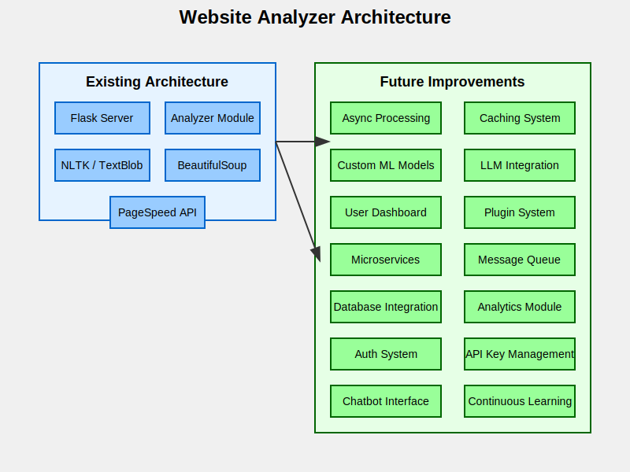

# Website Analyzer

## Table of Contents
1. [Overview](#overview)
2. [KeyFeatures](#key-features)
3. [Libraries Used](#libraries-used)
4. [Alternative Method and Their Drawbacks](#alternative-method-and-their-drawbacks)
5. [Custom ML Models for Content Analysis](#custom-ml-models-for-content-analysis)
6. [Installation](#installation)
7. [Usage](#usage)
8. [Architecture](#architecture)
9. [Future Improvements](#future-improvements)

## Overview

The Website Analyzer is a powerful tool that provides comprehensive analysis of websites, including content, structure, SEO, technical details, compliance, and Core Web Vitals. It uses traditional NLP libraries and APIs for efficient, cost-effective analysis without the need for complex language models.

### Key Features
- Content analysis (words frequency, sentiment, topics)
- Structure analysis (navigation, headings, design patterns)
- SEO analysis (title, meta description, image alt texts)
- Technical analysis (technologies used, load time)
- Compliance Analysis (privacy policy, terms of service, accessibility)
- Core Web Vitals metrics using Google PageSpeed Insights API

#### 1.1 analyzer.py
   This file contains the core functionality for website analysis. It includes several functions:

   ```scrape_website(url)```: Fetches the content of a given URL.

   ```analyze_content(soup, text)```: Analyzes the textual content of the website.
   
   ```analyze_structure(soup)```: Examines the HTML structure of the website.
   
   ```analyze_seo(soup)```: Evaluates basic SEO elements.
   
   ```analyze_technical(soup, load_time)```: Identifies technologies used and load time.
   
   ```analyze_compliance(soup, url)```: Checks for privacy policy and 
   accessibility features.
   
   ```fetch_core_web_vitals(url)```: Retrieves Core Web Vitals metrics using Google's PageSpeed Insights API.
   
   ```analyze_website(url)```: Orchestrates the entire analysis process.
   
   ```save_results_to_file(url, results)```: Saves the analysis results to a JSON file.

#### 1.2 app.py
   This file sets up a Flask web server with a single endpoint:

   ```/analyze```: Accepts POST requests with a URL to analyze, calls the ```analyze_website``` function, and returns the results as JSON.

## Libraries Used

   - requests: Used for making HTTP requests to fetch web pages.
   - BeautifulSoup: Used for parsing HTML and extracting information.
   - NLTK: Used for natural language processing tasks like tokenization and sentiment analysis.
   - TextBlob: Used for additional NLP tasks like noun phrase extraction.
   - Flask: Used for creating the web server.
   - Flask-CORS: Used for handling Cross-Origin Resource Sharing (CORS).

## Alternative Method and Their Drawbacks

### Selenium for dynamic content:

   - Pros: Can interact with JavaScript-rendered content.
   - Cons: Slower, requires a browser driver, more resource-intensive.


## Custom ML Models for Content Analysis
 - Custom ML models can be tailored to specific use cases, potentially offering more accurate and relevant analysis. 
 - However, they require significant data and expertise to develop and maintain.

### Specific Models and Their Drawbacks:

#### Topic Modeling (e.g., LDA - Latent Dirichlet Allocation)

 - Pros: Unsupervised learning, can discover hidden topics in large collections of text.
 
 - Cons: Requires careful preprocessing, results can be difficult to interpret,    and topic coherence can be inconsistent.


#### Text Classification (e.g., Naive Bayes, SVM, or Neural Networks)

 - Pros: Can categorize content into predefined categories with high accuracy.
 - Cons: Requires labeled training data, which can be expensive and time-consuming to create. May struggle with out-of-domain content.


#### Named Entity Recognition (NER) Models

 - Pros: Can identify and classify named entities (e.g., person names, organizations) in text.
 - Cons: May require domain-specific training data for optimal performance. Can struggle with ambiguous entities or novel domains.

#### Sentiment Analysis Models (e.g., VADER or custom deep learning models)

 - Pros: Can provide more nuanced sentiment analysis than off-the-shelf solutions.
 - Cons: Requires substantial labeled data for training. May struggle with sarcasm, context-dependent sentiments, or domain-specific language.


#### Text Summarization Models

 - Pros: Can generate concise summaries of web content, useful for quick analysis.
 - Cons: Extractive methods may miss context, while abstractive methods can be computationally expensive and potentially generate inaccurate information.


### Using Current LLMs via API
1. Modern Large Language Models (LLMs) like GPT-3, GPT-4, or BERT-based models can potentially perform many of these content analysis tasks without the need for custom model development.
Pros of using LLM APIs:

2. Versatility: Can perform multiple tasks (classification, NER, summarization, sentiment analysis) with a single model.
No need for extensive training data or ML expertise.
Regularly updated, incorporating the latest advancements.
Can handle a wide range of domains and languages.

#### Cons and Drawbacks:

- API costs can be significant, especially for high-volume analysis.
- Less control over the specific behavior of the model.
- Potential privacy concerns when sending data to external APIs.
- May produce inconsistent or hallucinated results, especially for highly specialized domains.
- Latency can be an issue for real-time applications.
- Dependence on third-party services and potential vendor lock-in.

### Examples of LLM APIs:

1. OpenAI's GPT-3 and GPT-4 APIs
2. Google's Vertex AI (PaLM API)
3. Anthropic's Claude API
4. Hugging Face's Inference API for various models

When considering the use of LLMs via API for content analysis, it's important to weigh the convenience and power they offeragainst the potential drawbacks in terms of cost, control, and specific performance requirements of your application.

## Installation

1. Clone the repository:
   ```
   git clone https://github.com/kna-core/ByteBenders.git
   cd ByteBenders/scraper
   ```

2. Install required packages:
   ```
   pip install -r requirements.txt
   ```

3. Set up environment variables:
   ```
   export GOOGLE_API_KEY=your_google_api_key_here
   ```

## Usage

1. Start the Flask server:
   ```
   python app.py
   ```

2. Send a POST request to analyze a website:
   ```
   curl -X POST -H "Content-Type: application/json" -d '{"url": "https://example.com"}' http://localhost:5000/analyze
   ```

3. The analysis results will be returned in the response and saved to a file in the `website_analysis_results` directory.

## Architecture

The current architecture of the Website Analyzer is simple and straightforward:



### Components
1. `analyzer.py`: Contains the main logic for website analysis
2. `app.py`: Sets up a Flask web server to expose the analysis functionality via an API
3. Local JSON Storage: Saves analysis results locally

## Future Improvements

1. **Enhanced Content Analysis**
   - Implement topic modeling using LDA or more advanced techniques like BERT-based clustering.
   - Develop a custom text classification model for categorizing web pages into predefined or dynamically generated categories.
   - Integrate a fine-tuned Named Entity Recognition model to extract key information from web content.
   - Improve sentiment analysis by training a domain-specific model or fine-tuning an existing model on web content data.

2. **LLM Integration**
   - Integrate an LLM API (e.g., GPT-4, Claude) for more advanced text analysis tasks.
   - Implement a summarization feature using LLM to provide concise overviews of analyzed web pages.
   - Use LLM for generating SEO improvement suggestions based on the analyzed content.
   - Develop a question-answering system about the website's content using LLM capabilities.

3. **Hybrid Approach**
   - Combine rule-based systems, custom ML models, and LLM APIs to leverage the strengths of each approach.
   - Implement an ensemble model that combines outputs from different analysis methods for more robust results.

4. **Performance Optimization**
   - Implement asynchronous processing using libraries like aiohttp and asyncio for faster multi-page analysis.
   - Develop a caching system to store and quickly retrieve analysis results for previously visited pages.
   - Optimize API calls to external services (like LLM APIs) to reduce latency and costs.

5. **User Experience Enhancements**
   - Create a user-friendly dashboard for visualizing analysis results, potentially using libraries like D3.js or Chart.js.
   - Implement custom analysis rulesets, allowing users to define their own criteria for website evaluation.
   - Develop a comparison feature to analyze multiple websites or track changes over time.

6. **Scalability Improvements**
   - Refactor the application into a microservices architecture for better scalability and maintainability.
   - Implement a message queue system (e.g., RabbitMQ, Apache Kafka) for handling large volumes of analysis requests.
   - Set up a distributed system for parallel processing of multiple websites or large websites with many pages.

7. **Data Management and Analytics**
   - Integrate a database system (e.g., PostgreSQL, MongoDB) for storing analysis results and enabling advanced querying.
   - Implement data versioning to track changes in website analysis over time.
   - Develop an analytics module to provide insights across multiple analyzed websites.

8. **Security and Compliance**
   - Implement robust user authentication and authorization systems.
   - Develop a secure API key management system for accessing LLM and other external services.
   - Ensure GDPR compliance for storing and processing website data.

9. **Extensibility**
   - Create a plugin system allowing third-party developers to add new analysis modules.
   - Develop an API for integrating the Website Analyzer into other applications or workflows.

10. **Continuous Learning and Improvement**
    - Implement a feedback loop system where users can rate analysis accuracy, using this data to continuously improve models.
    - Set up an automated system for periodically retraining models on new data to keep them up-to-date with the latest web trends.

11. **Specialized Analysis Modules**
    - Develop modules for specific types of websites (e.g., e-commerce, blogs, portfolios) with domain-specific insights.
    - Create an accessibility analysis module using ML to evaluate websites for WCAG compliance.

12. **Natural Language Interaction**
    - Implement a chatbot interface using LLM for natural language interactions about website analysis results.
    - Develop voice command functionality for hands-free operation of the analyzer.
